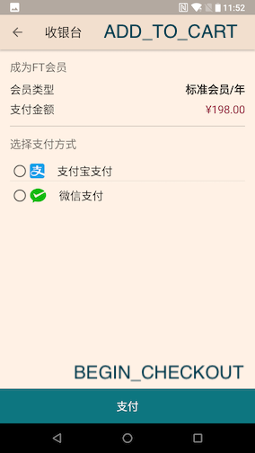

## Events and Params Used in Android Version 1.1.0

### App Open

#### `APP_OPEN` Event

When user opend or returned to the app. It is called in the `MainActivity`'s `onResume` method. It might record much more times than "cold launch".

Parameters:

* `SUCCESS` Its value is an ISO8601 date time string in device's local zone: `2018-11-26T14:22:20+08:00`.

### Subscription and Payment

#### `ADD_TO_CHART` Event

The moment user opens this screen:



Parameters used for this event:

* `ITEM_ID`. Its value is the combination of membership's tiers and billing cycles.

`member_tier` is an enum: `standard`, `premium`.
`billing_cycle` is an enum: `year`, `month`.

The combination will produce values for `ITEM_ID`: `standard_year`, `standard_month`, `premium_year`.

* `ITEM_NAME`. Its value is one of `member_tier`'s value.

* `ITEM_CATEGORY`. Its value is one of `billing_cycle`.

* `QUANTITY` Its value is a constant `1`.

#### `BEGIN_CHECKOUT` Event

When user selected a pyament method and clicked "支付" button in the above screenshot.

Parameters used for this event:

* `VALUE` Its value is a double, indicating the amount charged to a user. This value is set by Subscription API and received by client together with parameters used to call wechat pay and alipay.

Response of Subscription API for wechat pay:
```json
{
    // Provided to client app to know which order to query later.
    "ftcOrderId": "",
    // The actual price charged for this order.
    "price": 198.00,
    // The following the requried by wechat pay sdk.
    "appid": "",
    "partnerid": "",
    "prepayid": "",
    "package": "",
    "noncestr": "",
    "timestamp": "",
    "sign": ""
}
```

For Alipay:
```json
{
    "ftcOrderId": "",
    "price": 198.00,
    // The value of param is used to call alipay sdk.
    "param": ""
}
```

The value of `price` field is included in the response of both payment method and is used as the value of `VALUE` param.

Howerver, current version of Subscription API (as of 2018-11-26) has not implemented the `price` field yet. Client app might get `0.0`.

* `CURRENCY` is a constant string `CNY`.

* `METHOD` Its value is an enum correspondig to our database definition of `payment_method`: `alipay` for Zhifubao, `tenpay` for Wechat, and `stripe` for Stripe.

#### `ECOMMERCE_PURCHASE` Event

When user paid successfully.

Parameters:

* `CURRENTCY` is `CNY`
* `VALUE` is the same as in `CHECKOUT_EVENT`
* `METHOD` is the same as in `CHECKOUT_EVENT`

### Reading

#### `SELECT_CONTENT` Event

The moment user clicked an item in a list of articles in any of channel page.

* `CONTENT_TYPE` Its value is `story | premium | video | interactive | column` ...
* `ITEM_ID` is the id of an article or channel, etc..

#### `VIEW_ITEM` Event

When an article is fully loaded.

* `ITEM_ID` the id of an article or channel.
* `ITEM_NAME` The title of an article
* `ITEM_CATEGORY` `story, premium, video ...` (or use `CONTENT_TYPE`?)

### Login

#### `LOGIN` Event

Parameters:

* `METHOD` Its value is `email` currently. Later `wechat` will be added when API supports wechat login.

### Signup

#### `SIGN_UP` Event

Parameters:

* `METHOD` save as the one used in `LOGIN` event.

#### `SHARE`

* `CONTENT_TYPE` story, video ...
* `ITEM_ID` the id of an article
* `METHOD` used only for wechat share. Its a constant `wechat`.

### App Launch

This uses custom event names:
```kotlin
// when a user clicks an ad.
const val AD_CLICK = "ftc_ad_click"
// when an ad is shown to user without being manually skipped.
const val AD_VIEWED = "ftc_ad_viewed"
// When a user skips an ad.
const val AD_SKIP = "ftc_ad_skip"
```
#### `AD_SKIP` Event

When user clicked the skip button.

NOTE: Android used a count down timer button, rather than a simple close button.

No parameters set.

#### `AD_CLICK`

When user clicked the ad and a browser is opend to show the ad.

A clicked ad is terminated immediately (meaning timer stops) while the browser opens the link to the ad.

#### `AD_VIEWED`

When user did not skip the ad, did not click the link to ad and watched and waited for the ad to play from beginning to end.
